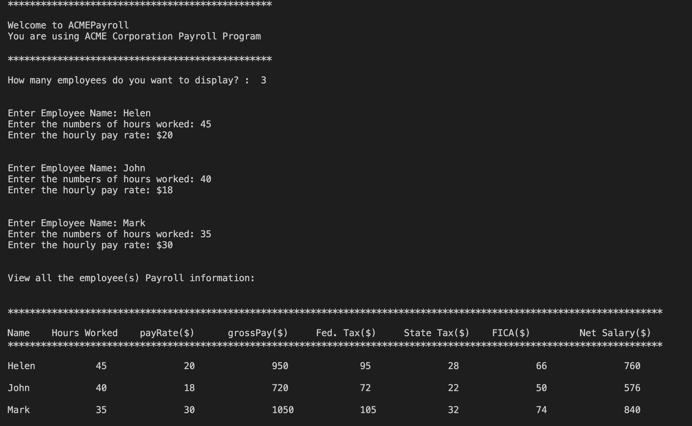

# pythonpayroll
ACME Corporation needs a simple payroll program written in Python. The program accepts as input for each employee: Employee Name, Hours worked, Pay Rate (hourly).
Employees are to receive 1.5x pay rate for hours over 40. Fed Tax = 10%, State tax = 3%,FICA rate = 7%
The Output is: Name Hours Rate Grosspay Fed Tax State Tax FICA Netpay.
In addition, the program with require a number of employees and generate their data.

The program is written in Python.

#View of output for one employee

#View of output for several employees.
